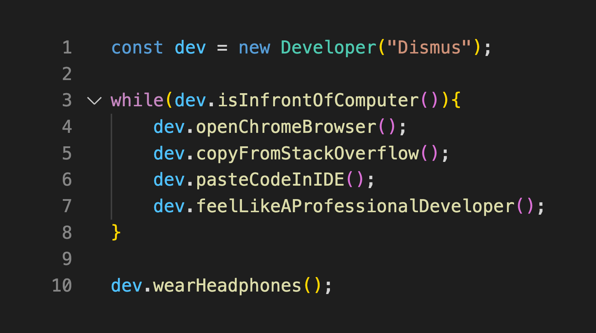

    
  VISITS  
    
  

Hi! It is I, Dismus Ng'eno, a Seasoned Full-Stack Software Developer with a love for `HTML`, `CSS`, `SASS`, `LESS`, `Vanilla JavaScript`, `React`, `Redux`, `NodeJs`, `Laravel`, `MongoDB`, `Express Js`, among others. A Software enthusiast with top-notch abilities in UX/UI design, web development, deployment and testing. I seek to bring knowledge and abilities to any new position with a growing team. Open to new opportunities. :smile: 

##  &nbsp;Tech Stack

&nbsp;
&nbsp;
&nbsp;
&nbsp;
&nbsp;
&nbsp;
\
&nbsp;
&nbsp;
&nbsp;
&nbsp;
\
&nbsp;
\
&nbsp;
&nbsp;

### &nbsp;GitHub Analytics

### 🤝🏻 &nbsp;Connect with Me

<a target="_blank"
href="https://www.linkedin.com/in/dismus-kiplimo/"></img></a> <a target="_blank"
href="mailto:dismuskiplimo@gmail.com"></img></a> <a target="_blank"
href="https://twitter.com/dismus_kiplimo"></img></a>

<!--
**dismuskiplimo/dismuskiplimo** is a ✨ _special_ ✨ repository because its `README.md` (this file) appears on your GitHub profile.
-->
